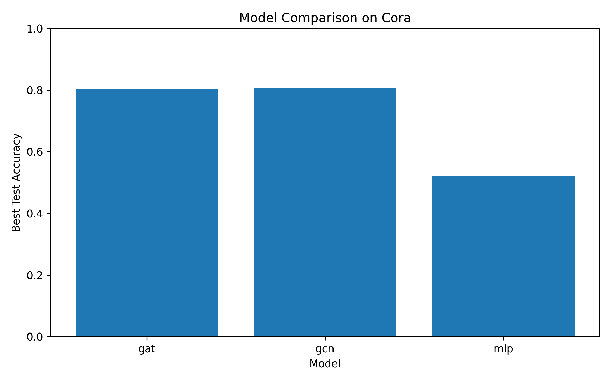

[English](./README.md) | [中文](./README_zh.md)

# Graph Text Node Classification

This project explores node classification on the Cora citation network using graph learning methods.

## Project Overview

The goal of this project is to reproduce several baseline models for node classification, including:
- MLP
- GCN
- GAT

This project also serves as a small and reproducible graph learning practice project.

## Dataset

We use the **Cora** citation network dataset from PyTorch Geometric.

- **Nodes**: academic papers
- **Edges**: citation links between papers
- **Node Features**: bag-of-words representations
- **Labels**: paper categories

## Motivation

Many real-world data are naturally relational, such as citation networks, social networks, recommender systems, and knowledge graphs. Graph learning methods can leverage both node attributes and structural information. This project aims to understand the value of graph neural networks and build a small but reproducible graph learning pipeline.

## Models

The following models are included in this project:
- **MLP**: a non-graph baseline using only node features
- **GCN**: Graph Convolutional Network
- **GAT**: Graph Attention Network

## Project Structure

    graph-text-node-classification/
    ├─ README.md
    ├─ README_zh.md
    ├─ requirements.txt
    ├─ train.py
    ├─ models.py
    ├─ utils.py
    ├─ report.md
    ├─ plot_results.py
    ├─ results/
    │  ├─ metrics.csv
    │  └─ comparison.png

## Results

The following results were obtained on the Cora dataset:

| Model | Best Validation Accuracy | Best Test Accuracy |
|------|--------------------------:|-------------------:|
| MLP  | 0.5200 | 0.5230 |
| GCN  | 0.7840 | 0.8060 |
| GAT  | 0.7820 | 0.8040 |

## Visualization

## Key Findings

- The MLP baseline performs much worse than graph neural networks.
- GCN and GAT both significantly outperform MLP on the Cora dataset.
- GCN achieves the best result in the current setting, while GAT performs similarly.
- These results show that graph structure is highly informative for node classification.

## How to Run

Install dependencies:

    pip install -r requirements.txt

Run training:

    python train.py --model mlp
    python train.py --model gcn
    python train.py --model gat

Plot results:

    python plot_results.py

## Future Work

As a further step, this project can be extended to explore text feature fusion, combining semantic text embeddings with graph features for node classification.
